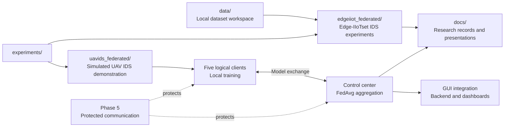

# Federated Learning-Based Intrusion Detection for IoT Networks

This project investigates binary intrusion detection for IoT network traffic using centralized and federated learning. This directory is the main project workspace for research records, experiment implementations, and the simulated UAV demonstration.

## Project overview

The project trains models to distinguish `Normal` traffic from `Attack` traffic while examining how local training can be coordinated without pooling every client's records into one training dataset. Its implemented research tracks use published Edge-IIoTset and UAVIDS-2025 data and compare centralized, local, and Federated Averaging (FedAvg) workflows where appropriate.

The UAVIDS track provides the main deployment demonstration. Five source-based logical clients simulate UAV participants, train locally on non-identically distributed partitions, and send model updates to a control center for FedAvg aggregation. These clients are demonstration identities derived from a simulated dataset, not verified physical aircraft.

The containerized UAVIDS workflow includes both a plain communication baseline and a post-quantum-secured phase that protects application-level model exchange. Backend and dashboard adapters expose inference, federated progress, and security evidence for presentation use. Implementation and operating details remain in the relevant experiment directories.

## High-level architecture



The two experiment workspaces own their data preparation, training, evaluation, deployment, and result details. The project-level `docs/` directory holds broader research records and presentation material.

## Current directory layout

```text
ids-fl-project/
|-- data/              # Local dataset workspace; tracked as an empty placeholder
|-- docs/              # Project research record, references, and presentations
|-- experiments/       # Implemented Edge-IIoTset and UAVIDS experiment workspaces
|-- notebooks/         # Reserved top-level notebook workspace
|-- src/               # Reserved shared-code hierarchy
|-- .gitignore         # Excludes raw data, generated artifacts, caches, and local environments
|-- requirements.txt   # General data-analysis and notebook dependencies
`-- README.md          # Documentation for this directory
```

## Component navigation

| Directory | Responsibility | Documentation |
| --- | --- | --- |
| [`data/`](data/) | Provides the repository-level location for local raw data. Dataset contents are intentionally ignored by Git. | Pending |
| [`docs/`](docs/) | Stores the project-wide research status record, reference material, and presentation assets. | Pending |
| [`experiments/`](experiments/) | Contains the implemented Edge-IIoTset and UAVIDS federated intrusion-detection workspaces. | Pending |
| [`notebooks/`](notebooks/) | Reserves a location for notebooks shared at this project level; it currently contains only a placeholder. | Pending |
| [`src/`](src/) | Reserves shared `evaluation`, `models`, `preprocessing`, and `results` areas; these currently contain placeholders only. | Pending |

## Top-level files

| File | Purpose |
| --- | --- |
| [`.gitignore`](.gitignore) | Defines repository-wide exclusions for local datasets, credentials, environments, caches, generated models, and runtime output, with explicit exceptions for selected evidence artifacts. |
| [`requirements.txt`](requirements.txt) | Lists general data-analysis, classical machine-learning, plotting, Kaggle, and Jupyter dependencies. Individual experiments maintain additional dependency files where needed. |
| [`README.md`](README.md) | Provides the overview and documentation map for `ids-fl-project/`. |

## Getting started

From the repository root, enter this workspace:

```powershell
cd ids-fl-project
```

There is no single launcher, Compose file, or complete dependency manifest at this level. Choose an implemented experiment and follow the commands documented in its own README:

- [DNN-EdgeIIoT binary federated IDS experiment](experiments/edgeiiot_federated/README.md)
- [UAVIDS-2025 federated intrusion-detection experiment](experiments/uavids_federated/README.md)

New contributors should read the applicable experiment guide first, then inspect [`docs/RESEARCH_STATUS.md`](docs/RESEARCH_STATUS.md) for the dated Edge-IIoTset research record. UAVIDS modeling, Docker, security, backend, and dashboard instructions are owned by the UAVIDS workspace and its nested documentation.

## Documentation roadmap

Each major directory will receive a README that owns its detailed documentation. No immediate child directory is documented yet.

- [ ] `data/README.md`
- [ ] `docs/README.md`
- [ ] `experiments/README.md`
- [ ] `notebooks/README.md`
- [ ] `src/README.md`

## Project status and limitations

- The UAV fleet is a simulated, demonstration-scale environment built from logical source partitions; it is not a deployment on verified physical UAVs.
- The experiments use published research datasets, not real or classified military traffic. Raw datasets are not committed to this directory.
- The containerized demonstrations are designed for CPU execution. Hardware profiles and resource limits are illustrative rather than measurements from deployed aircraft.
- The post-quantum security phase is an academic application-layer prototype, not production infrastructure or a complete privacy solution.
- Experiment-specific results, assumptions, and limitations are documented with the experiment that produced them.
