# Edge-IIoT Federated Learning Experiment

This workspace evaluates binary intrusion detection on the DNN-EdgeIIoT dataset with PyTorch models and five simulated federated clients. It contains the current full-data experiment, an accepted leakage-controlled trial, and the earlier historical implementation from which those experiments evolved.

[Project overview](../../README.md)

## Experiment overview

The task maps `Attack_label = 0` to **Normal** and `Attack_label = 1` to **Attack**. The current experiment cleans the laboratory-generated packet records, creates group-disjoint train, validation, and test splits, fits preprocessing on training rows only, and partitions the training data across five IID (independent and identically distributed) clients named `Factory_A` through `Factory_E`.

Each client trains the same multilayer perceptron (MLP) locally. Flower Federated Averaging (FedAvg) combines all five updates by client sample count, and the server selects a global checkpoint using validation macro-F1 before evaluating it once on the held-out test split. This is an in-process simulation; it does not transmit updates between real sites.

The experiment has three generations:

| Track | Entry point | Status |
| --- | --- | --- |
| Full clean population | [`notebooks/03_full_dataset_federated_pipeline.ipynb`](notebooks/03_full_dataset_federated_pipeline.ipynb) | Current Edge-IIoT continuation; uses all 15,827 clean unique rows and trains only the federated model. |
| Balanced clean trial | [`notebooks/02_simple_clean_federated_pipeline.ipynb`](notebooks/02_simple_clean_federated_pipeline.ipynb) | Accepted 10% trial; establishes the leakage controls and compares centralized and federated models. |
| First-generation pipeline | [`notebooks/01_binary_federated_pipeline.ipynb`](notebooks/01_binary_federated_pipeline.ipynb) and [`src/`](src/) | Historical only; its perfect result is affected by source-format and duplicate-pattern leakage identified by the later audit. |

## Experiment objectives

- Evaluate a binary Normal-versus-Attack classifier without using raw identities, payload content, attack names, or other reviewed shortcuts as model inputs.
- Keep capture groups and exact final-feature patterns disjoint across training, validation, and test data.
- Compare a centralized MLP with five-client FedAvg in the balanced clean trial.
- Test the federated workflow at the full clean-data scale while preserving natural class prevalence.
- Save configuration, distributions, metrics, and feature-control records for review.

## Architecture

```mermaid
flowchart LR
    Data["DNN-EdgeIIoT CSV"] --> Audit["Schema audit, grouping,<br/>cleaning, and deduplication"]
    Audit --> Split["Group-disjoint<br/>train / validation / test"]
    Split --> Prep["Training-fitted<br/>imputation and scaling"]
    Prep --> Clients["Five IID client shards"]
    Clients --> Local["Sequential local<br/>MLP training"]
    Local --> FedAvg["Sample-weighted<br/>Flower FedAvg"]
    FedAvg --> Validation["Central validation and<br/>best-checkpoint selection"]
    Validation -->|next round| Clients
    Validation --> Test["One-time held-out<br/>test evaluation"]
    Test --> Outputs["Metrics and run artifacts"]
```



Client shards and model updates remain inside one Python process. Central preprocessing and validation are simulation conveniences, not privacy-preserving federated protocols.

## Directory structure

```text
edgeiiot_federated/
|-- notebooks/             # Executed historical, clean-trial, and full-data workflows
|-- src/                   # Modular first-generation data, model, training, and Flower code
|-- tests/                 # Fast tests for the modular pipeline
|-- artifacts/             # Historical preprocessing metadata
|-- artifacts_clean/       # Clean-trial feature and exclusion metadata
|-- artifacts_full/        # Full-data feature and exclusion metadata
|-- results/               # Historical metrics; not accepted performance evidence
|-- results_clean/         # Accepted balanced-trial results and report
|-- results_full/          # Current full-data distributions, audit, and metrics
|-- build_notebook.py      # Rebuilds notebook 01
|-- build_notebook_03.py   # Rebuilds notebook 03
|-- smoke_test.py          # Short end-to-end test of the modular pipeline
|-- pyproject.toml         # Package metadata and dependency ranges
|-- requirements.txt       # Versions used for the recorded environment
`-- README.md              # Documentation for this experiment
```

## File reference

| Path | Purpose |
| --- | --- |
| [`notebooks/03_full_dataset_federated_pipeline.ipynb`](notebooks/03_full_dataset_federated_pipeline.ipynb) | Loads only the approved schema, uses every clean unique row, trains five sequential clients, and records the current full-data result. |
| [`notebooks/02_simple_clean_federated_pipeline.ipynb`](notebooks/02_simple_clean_federated_pipeline.ipynb) | Defines the leakage-controlled cleaning policy and runs the balanced centralized/FedAvg comparison. |
| [`notebooks/01_binary_federated_pipeline.ipynb`](notebooks/01_binary_federated_pipeline.ipynb) | Executed first-generation experiment retained for provenance; do not cite its perfect score as the accepted result. |
| [`src/config.py`](src/config.py) | Defines paths and defaults for the modular first-generation pipeline. |
| [`src/data.py`](src/data.py) | Loads, audits, cleans, samples, and randomly splits data for the modular pipeline. |
| [`src/preprocessing.py`](src/preprocessing.py) | Builds training-fitted numeric and categorical preprocessing. |
| [`src/model.py`](src/model.py) | Defines the shared binary MLP and random-seed helper. |
| [`src/partitioning.py`](src/partitioning.py) | Produces disjoint, class-balanced IID client partitions. |
| [`src/client_app.py`](src/client_app.py), [`src/server_app.py`](src/server_app.py), [`src/federated.py`](src/federated.py) | Implement the first-generation Flower client, FedAvg server, and simulation orchestration. |
| [`src/training.py`](src/training.py), [`src/evaluation.py`](src/evaluation.py) | Provide model training, parameter conversion, evaluation metrics, and plots. |
| [`src/inference.py`](src/inference.py) | Scores raw rows with generated first-generation preprocessing and model artifacts. |
| [`tests/test_pipeline.py`](tests/test_pipeline.py) | Tests model shape, parameter exchange, partition validity, preprocessing, and metric safety without the dataset. |
| [`smoke_test.py`](smoke_test.py) | Runs a shortened historical pipeline with three centralized epochs and one federated round. |
| [`requirements.txt`](requirements.txt) | Pins the Python packages used and tested for the saved runs. |
| [`pyproject.toml`](pyproject.toml) | Declares Python 3.11+, package dependencies, optional notebook/test dependencies, and pytest discovery. |

## Dataset requirements

The required input is a CSV named `DNN-EdgeIIoT-dataset.csv`. It is not stored in this repository and must be obtained separately. By default, the experiment searches for it at:

```text
../../data/raw/DNN-EdgeIIoT-dataset.csv
```

Set `EDGEIIOT_DATASET` to use another location:

```powershell
$env:EDGEIIOT_DATASET = "D:\path\to\DNN-EdgeIIoT-dataset.csv"
```

The notebooks require binary `Attack_label` values `{0, 1}`. The clean workflows also require `Attack_type` and `frame.time` to construct capture groups before excluding them from model features. Notebook 03 freezes the model input to the 25 fields in [`artifacts_full/feature_list.json`](artifacts_full/feature_list.json) and stops if required fields are missing or an unreviewed source field appears.

The clean workflows exclude attack names, timestamps, host addresses, ports, payloads, raw protocol text, checksums, packet/session identifiers, confirmed source-format contamination, and constant fields. The exact reviewed exclusions are recorded in [`artifacts_clean/dropped_columns.csv`](artifacts_clean/dropped_columns.csv) and [`artifacts_full/dropped_columns.csv`](artifacts_full/dropped_columns.csv).

No dataset download URL, dataset license, or source-file checksum is recorded in this directory, so those details are intentionally not asserted here.

## Experiment configuration

The following settings describe the current full-data workflow, not every historical run.

| Setting | Verified value | Defined in |
| --- | --- | --- |
| Task | Binary Normal (`0`) versus Attack (`1`) classification | [`notebook 03`](notebooks/03_full_dataset_federated_pipeline.ipynb) |
| Dataset scope | All clean unique rows after conflict removal and exact-feature deduplication | [`notebook 03`](notebooks/03_full_dataset_federated_pipeline.ipynb) |
| Split | Target 70% train / 15% validation / 15% test, with indivisible capture groups | [`notebook 03`](notebooks/03_full_dataset_federated_pipeline.ipynb) |
| Number of clients | 5 (`Factory_A` to `Factory_E`) | [`notebook 03`](notebooks/03_full_dataset_federated_pipeline.ipynb) |
| Client partition | Row-level IID shards preserving natural training prevalence | [`results_full/run_summary.json`](results_full/run_summary.json) |
| Model | MLP: 25 inputs, hidden layers 128/64/32, ReLU, dropout 0.20/0.10, one logit | [`notebook 03`](notebooks/03_full_dataset_federated_pipeline.ipynb) |
| Loss | `BCEWithLogitsLoss`, weighted by training Normal/Attack counts | [`results_full/run_summary.json`](results_full/run_summary.json) |
| Optimizer / learning rate | Adam / `0.001` | [`notebook 03`](notebooks/03_full_dataset_federated_pipeline.ipynb) |
| Aggregation | Flower FedAvg weighted by `num-examples`; all clients participate | [`notebook 03`](notebooks/03_full_dataset_federated_pipeline.ipynb) |
| Federated rounds | 10 | [`results_full/run_summary.json`](results_full/run_summary.json) |
| Local epochs | 2 per client per round | [`results_full/run_summary.json`](results_full/run_summary.json) |
| Batch size | 512 | [`results_full/run_summary.json`](results_full/run_summary.json) |
| Decision threshold | 0.5 | [`results_full/run_summary.json`](results_full/run_summary.json) |
| Checkpoint criterion | Highest validation macro-F1 | [`results_full/run_summary.json`](results_full/run_summary.json) |
| Random seed | 42 | [`results_full/run_summary.json`](results_full/run_summary.json) |

Notebook 02 uses the same five clients, MLP shape, learning rate, local epochs, rounds, threshold, and seed, but uses a balanced 10% sample, batch size 256, an unweighted loss, and a centralized comparison. The modular `src/` defaults are documented in [`src/config.py`](src/config.py) and belong to the historical pipeline.

## Data-processing workflow

Notebook 03 applies the current workflow in this order:

1. Read the CSV header and assert the approved schema.
2. Load the 25 approved model features plus `Attack_label`, `Attack_type`, and `frame.time`.
3. Build pure-label capture groups from attack/capture blocks, time resets, five-minute windows, and bounded 10,000-row chunks.
4. Normalize semantic missing and zero values, convert approved fields to numeric values, and treat infinity as missing.
5. Remove feature patterns that occur with conflicting binary labels, then retain one row from each remaining same-label exact-feature pattern.
6. Assign whole capture groups deterministically to train, validation, and test splits while targeting a 70/15/15 row distribution within each class.
7. Assert zero capture-group overlap and zero exact-feature overlap across the three splits.
8. Fit median imputation and standard scaling only on the training rows, then transform validation and test rows.
9. Audit each retained feature with a training-only decision stump and save the audit.
10. Divide each training class across five disjoint IID client shards and begin federated training.

Notebook 02 uses the same core controls, then selects a balanced 10% modeling sample from group-disjoint pools. Notebook 01 instead uses a random-row split after a narrower exclusion policy; its saved 72-feature representation includes fields later identified as source-format contamination. Its results are therefore historical rather than accepted evidence.

## Federated-learning workflow

One current federated round proceeds as follows:

1. Each of the five clients receives the current global MLP parameters.
2. Clients run sequentially in-process and train only on their own shard for two local epochs.
3. Each client returns its updated parameters and training example count.
4. Flower FedAvg computes a sample-count-weighted global parameter set.
5. The server evaluates the global model on the central validation split.
6. The notebook saves a new checkpoint when validation macro-F1 improves.
7. After round 10, the selected checkpoint is evaluated once on the test split.

No client sends data or model updates over a network in this experiment. It does not implement secure aggregation, post-quantum cryptography, differential privacy, Docker deployment, a backend, or a dashboard.

## Prerequisites and setup

Python 3.11 was used for the recorded runs. [`requirements.txt`](requirements.txt) pins the tested Windows environment, including PyTorch 2.5.1 with CUDA 12.1. The notebook logic can fall back to CPU; CUDA is optional, but a different PyTorch installation may be appropriate for a CPU-only machine.

From `ids-fl-project/experiments/edgeiiot_federated/`:

```powershell
py -3.11 -m venv .venv
.\.venv\Scripts\Activate.ps1
python -m pip install -r requirements.txt
```

The raw CSV is large, and loading or cleaning it is the dominant resource cost. Notebook 03 reduces memory pressure by reading only 28 required columns, sharing transformed arrays, limiting CPU threads, and training one client at a time.

## Running the experiment

Run these commands from `ids-fl-project/experiments/edgeiiot_federated/`. Set `EDGEIIOT_DATASET` first if the dataset is not at the default repository path.

### Current full-data run

```powershell
python -m jupyter nbconvert --to notebook --execute --inplace `
  --ExecutePreprocessor.timeout=1800 `
  notebooks/03_full_dataset_federated_pipeline.ipynb
```

This validates the frozen schema, rebuilds the clean population, trains the five-client federated model, and writes to `artifacts_full/` and `results_full/`. It does not train a centralized model.

### Accepted balanced clean trial

```powershell
python -m jupyter nbconvert --to notebook --execute --inplace `
  --ExecutePreprocessor.timeout=1800 `
  notebooks/02_simple_clean_federated_pipeline.ipynb
```

This reruns the balanced 10% centralized and federated comparison and writes to `artifacts_clean/` and `results_clean/`.

### Historical modular notebook

```powershell
python -m jupyter nbconvert --to notebook --execute --inplace `
  --ExecutePreprocessor.timeout=1800 `
  notebooks/01_binary_federated_pipeline.ipynb
```

This exercises the modular `src/` package and writes to `artifacts/` and `results/`. Use it only for historical or code-maintenance work; its saved performance is leakage-affected.

### Short modular smoke test

```powershell
py -3.11 smoke_test.py
```

The smoke test requires the dataset, loads it in full, runs three centralized epochs and one CPU federated round, and writes historical artifacts.

### Unit tests

```powershell
py -3.11 -m pytest -q
```

These tests do not require the Edge-IIoT CSV.

### Historical inference helper

After notebook 01 has generated `artifacts/preprocessor.joblib`, `artifacts/feature_names.json`, and `artifacts/global_model.pt`:

```powershell
python -m src.inference --csv D:\path\to\rows.csv
```

The input CSV must contain the raw feature columns recorded by the generated preprocessor metadata. Running without `--csv` expects the generated `artifacts/test_raw.csv`. These binary artifacts and test rows are not included in a clean checkout.

The two `build_notebook*.py` files are maintenance generators that rewrite notebooks 01 and 03. They are not required to execute an existing notebook and should be used only when intentionally regenerating those files.

## Inputs and outputs

### Inputs

| Input | Required by | Status in a clean checkout |
| --- | --- | --- |
| `../../data/raw/DNN-EdgeIIoT-dataset.csv` or `EDGEIIOT_DATASET` | All notebooks and `smoke_test.py` | Not included |
| Raw rows containing the historical input schema | `python -m src.inference --csv ...` | User supplied |
| Generated historical preprocessor and model | `src.inference` | Not included; produced by notebook 01 |

### Outputs

| Output | Producer | Repository status |
| --- | --- | --- |
| `artifacts_full/feature_list.json`, `dropped_columns.csv` | Notebook 03 | Tracked metadata |
| `artifacts_full/preprocessor.joblib`, `federated_global_model.pt` | Notebook 03 | Generated; not present in the current checkout |
| `results_full/run_summary.json`, `federated_final_metrics.json` | Notebook 03 | Tracked configuration and final metrics |
| `results_full/client_distributions.csv`, `split_distributions.csv` | Notebook 03 | Tracked distribution evidence |
| `results_full/federated_round_metrics.csv`, `client_round_metrics.csv` | Notebook 03 | Tracked round and client training records |
| `results_full/training_feature_audit.csv` | Notebook 03 | Tracked training-only feature audit |
| `artifacts_clean/feature_list.json`, `dropped_columns.csv` | Notebook 02 | Tracked metadata |
| `artifacts_clean/preprocessor.joblib`, `centralized_model.pt`, `federated_global_model.pt` | Notebook 02 | Generated and ignored; not present in the current checkout |
| `results_clean/*.json`, `*.csv` | Notebook 02 | Tracked clean-trial metrics and distributions |
| `results_clean/clean_federated_experiment_report.pdf` | Stored clean-trial report | Tracked; its generating command is not recorded in this workspace |
| `artifacts/` and `results/` | Notebook 01 or `smoke_test.py` | Historical metadata/results; generated binary models, preprocessor, cache, and raw test rows are ignored |

Notebook execution also updates the executed `.ipynb` file in place when using the documented `nbconvert` command.

## Results

### Current full-data federated run

The saved run used seed 42, all 15,827 clean unique rows, 25 numeric features, natural class prevalence, five IID clients, two local epochs, and ten FedAvg rounds. The group-disjoint split contained 11,079 training, 2,374 validation, and 2,374 test rows. Round 10 was selected by validation macro-F1.

| Metric | Result | Evidence |
| --- | ---: | --- |
| Accuracy | 0.97810 | [`federated_final_metrics.json`](results_full/federated_final_metrics.json) |
| Balanced accuracy | 0.97383 | [`federated_final_metrics.json`](results_full/federated_final_metrics.json) |
| Attack-class F1 | 0.98620 | [`federated_final_metrics.json`](results_full/federated_final_metrics.json) |
| Macro-F1 | 0.96657 | [`federated_final_metrics.json`](results_full/federated_final_metrics.json) |
| ROC-AUC | 0.99698 | [`federated_final_metrics.json`](results_full/federated_final_metrics.json) |
| Confusion matrix | TN 464, FP 16, FN 36, TP 1,858 | [`federated_final_metrics.json`](results_full/federated_final_metrics.json) |

The full configuration, row accounting, class distributions, hardware record, and timings are in [`results_full/run_summary.json`](results_full/run_summary.json).

### Accepted balanced clean trial

The accepted trial used seed 42, a balanced 1,582-row sample, 25 features, a group-disjoint 238-row test set, five balanced IID clients, and ten FedAvg rounds. Its best federated checkpoint was round 3.

| Model | Accuracy | Precision | Recall | F1 | ROC-AUC | Evidence |
| --- | ---: | ---: | ---: | ---: | ---: | --- |
| Centralized MLP | 0.97059 | 0.99123 | 0.94958 | 0.96996 | 0.99167 | [`centralized_final_metrics.json`](results_clean/centralized_final_metrics.json) |
| Federated global MLP | 0.97059 | 0.99123 | 0.94958 | 0.96996 | 0.99237 | [`federated_final_metrics.json`](results_clean/federated_final_metrics.json) |

These are single seeded runs, not uncertainty estimates. The perfect values stored in `results/` belong to the leakage-affected first-generation representation and are intentionally excluded from the accepted results tables.

## Reproducibility checklist

- [ ] Dataset release/version and source-file checksum recorded locally.
- [x] Required filename, schema checks, and environment override implemented.
- [x] Dependency versions recorded in [`requirements.txt`](requirements.txt).
- [x] Full-data configuration and hardware record saved in [`results_full/run_summary.json`](results_full/run_summary.json).
- [x] Random seed fixed at 42 in the recorded clean workflows.
- [x] Grouping, split method, overlap checks, and client construction recorded.
- [x] Training-only preprocessing and approved feature list implemented.
- [x] Round, split, client, audit, and final metrics committed as text artifacts.
- [ ] Full-data fitted preprocessor and selected model checkpoint included in the repository.
- [ ] Repeated-seed results or uncertainty intervals available.

## Limitations

- DNN-EdgeIIoT is laboratory-generated public research data; the five factory clients are simulated partitions, not independent organizations or operational deployments.
- Client data is IID. This workspace does not test heterogeneous or non-IID client behavior.
- “Full data” means every row remaining after conflicting-pattern removal and exact-feature deduplication, not all 2,219,201 source rows.
- Capture groups are heuristic proxies built from attack blocks, time windows, and bounded chunks; their definition needs sensitivity analysis.
- Preprocessing and validation are centralized, and clients execute sequentially in one process.
- The fixed 0.5 threshold was not tuned on the test set. Class weighting in the full run may affect probability calibration.
- Accepted metrics come from one seed and do not provide uncertainty estimates.
- The full-data generated model and preprocessor are absent, so the tracked text artifacts alone cannot perform inference.
- This experiment provides no secure aggregation, privacy mechanism, network transport, Docker deployment, or application integration.

## Relationship to other experiments

[`../uavids_federated/`](../uavids_federated/) is a separate UAVIDS-2025 continuation with its own data preparation, phases, deployment demonstrations, security work, and application components. Its clients, preprocessing, configurations, and results are owned by that workspace and should not be merged with or treated as directly comparable to the Edge-IIoT results documented here.

## Troubleshooting

| Problem | Likely cause | Resolution |
| --- | --- | --- |
| `Dataset not found` assertion | The CSV is absent from `../../data/raw/` | Place it at the default path or set `EDGEIIOT_DATASET` to the existing CSV. |
| Missing or unreviewed column assertion in notebook 03 | The source schema differs from the reviewed dataset | Verify that the intended DNN-EdgeIIoT CSV is being used; do not bypass the assertion without reviewing the changed fields. |
| Memory pressure while loading or cleaning | The source CSV is large, especially when fully loaded by notebooks 01/02 or `smoke_test.py` | Prefer notebook 03's restricted-column loader, close other memory-intensive applications, or use a machine with more available memory. |
| CUDA is unavailable or has less than 1 GiB free | Notebook 03's guarded device selection chose CPU | Continue on CPU or make sufficient compatible GPU memory available before restarting the kernel. |
| Inference reports missing `.joblib`, `.pt`, or `test_raw.csv` files | Generated historical artifacts are absent from the checkout | Execute notebook 01 to create them, or provide the required generated model/preprocessor artifacts from the matching run. |
| Notebook execution times out | The 30-minute `nbconvert` limit is insufficient for the hardware and dataset | Run the notebook interactively or increase `ExecutePreprocessor.timeout` while keeping the same working directory and inputs. |
