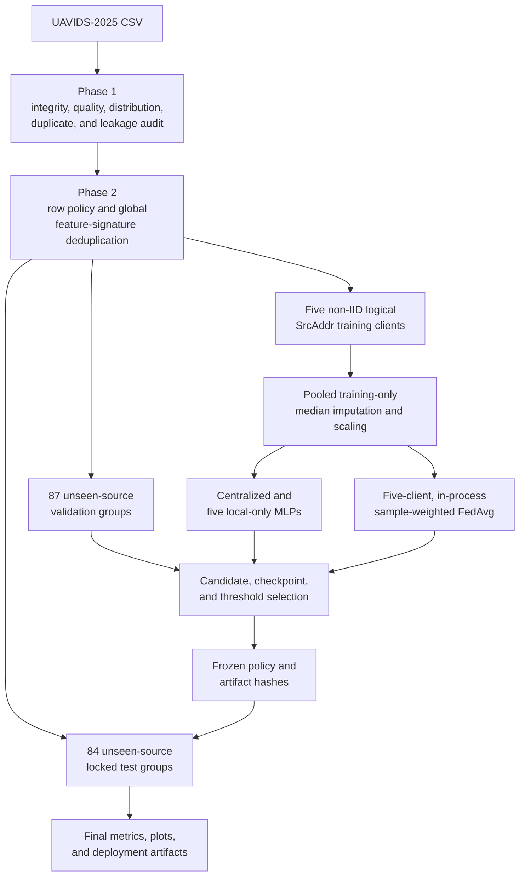

# UAVIDS Federated Learning Experiment

This workspace audits UAVIDS-2025 and evaluates binary intrusion detection across five simulated, source-based federated clients. It provides the research and validation basis for the project's simulated tactical UAV demonstration; it does not represent operational or classified military traffic.

## Navigation

[Project overview](../../README.md)

An experiments-level README does not currently exist at `../README.md`, so no link is provided for it.

## Experiment overview

The experiment uses the published UAVIDS-2025 flow dataset to classify `Normal Traffic` as Normal (`0`) and four documented attack classes as Attack (`1`). Five selected `SrcAddr` values form logical training clients with different natural class and attack-family distributions. They are not verified physical UAV identities.

Phase 1 audits the released CSV. Phase 2 applies the approved row policy and creates source-disjoint training, validation, and test partitions. Phase 3 fits preprocessing on the five pooled training partitions, compares centralized, local-only, and federated multilayer perceptrons (MLPs), locks all model and threshold decisions using validation data, and then performs one final test evaluation.

The federated path is a deterministic, single-process PyTorch simulation with an explicit sample-count-weighted FedAvg function. It does not use Flower or network transport. The later Docker, security, and GUI directories consume selected Phase 3 artifacts but own their detailed documentation.

## Experiment objectives

- Audit UAVIDS-2025 schema, integrity, class distributions, identifiers, duplicates, and potential leakage risks.
- Construct five source-based logical clients that preserve naturally different local distributions.
- Evaluate generalization to validation and test sets containing source addresses excluded from training.
- Prevent exact approved-feature signatures and source identities from crossing partition boundaries.
- Compare centralized pooling, isolated local-only training, and sample-weighted FedAvg under one preprocessing and model policy.
- Preserve the selected global checkpoint, preprocessor, configuration, metrics, and hashes for downstream demonstrations.

## Experiment architecture



The validation and test groups are source-address-disjoint from training and from each other. The repository does not contain scenario, run, capture-session, temporal, or physical-UAV identifiers needed to assert stronger independence.

## Directory layout

```text
uavids_federated/
|-- artifacts_phase3/        # Frozen global model, preprocessor, and feature metadata
|-- config/                  # Phase 2 policy and Phase 3 development/locked settings
|-- gui_integration/         # Downstream application handoff; documented separately
|-- notebooks/               # Executed Phase 1 audit and Phase 3-5 guide notebooks
|-- phase4/                  # Containerized FL demonstration; documented separately
|-- phase5/                  # Protected-update demonstration; documented separately
|-- results_audit/           # Tracked Phase 1 summary and audit metadata
|-- results_phase2/          # Tracked partition design summary and manifest
|-- results_phase3/          # Tracked Phase 3 summaries, record, and figures
|-- src/uavids_fl/           # Shared deterministic MLP, metrics, and FedAvg helpers
|-- tests/                   # Unit tests for Phase 3 core behavior
|-- prepare_phase2_partitions.py
|-- run_phase3_development.py
|-- run_phase3_final.py
|-- verify_phase3_artifacts.py
|-- generate_phase3_report.py
|-- requirements-phase3.txt
|-- requirements-guides.txt
`-- README.md
```

The generated `partitions/phase2/` directory is intentionally absent from the current checkout because repository-wide ignore rules exclude CSV data.

## File reference

| Path | Responsibility |
| --- | --- |
| [`notebooks/04_uavids_dataset_audit.ipynb`](notebooks/04_uavids_dataset_audit.ipynb) | Executed read-only audit of the official UAVIDS-2025 CSV and proposal of five logical clients. |
| [`prepare_phase2_partitions.py`](prepare_phase2_partitions.py) | Verifies the raw dataset, applies the row policy, assigns source groups, writes partitions, and asserts partition isolation. |
| [`config/phase2_partition_config.json`](config/phase2_partition_config.json) | Locks dataset hashes, client sources, label mapping, feature policy, exclusions, and held-out assignment rules. |
| [`results_phase2/partition_manifest.json`](results_phase2/partition_manifest.json) | Records row accounting, source assignments, client distributions, partition hashes, and verification outcomes. |
| [`run_phase3_development.py`](run_phase3_development.py) | Fits training-only preprocessing; performs candidate, centralized, local-only, and FedAvg development without opening `test.csv`; then writes the locked policy. |
| [`run_phase3_final.py`](run_phase3_final.py) | Hash-checks the locked policy and artifacts, transforms the final test once, evaluates seven models, and saves final evidence. |
| [`src/uavids_fl/modeling.py`](src/uavids_fl/modeling.py) | Defines the binary MLP, deterministic training, metrics, threshold selection, parameter cloning, and sample-weighted FedAvg. |
| [`config/phase3_development_config.json`](config/phase3_development_config.json) | Defines candidate models, training settings, validation selection, threshold search, and preprocessing policy. |
| [`config/phase3_locked_config.json`](config/phase3_locked_config.json) | Freezes the selected model, thresholds, artifact hashes, training policy, and final-test boundary. |
| [`artifacts_phase3/`](artifacts_phase3/) | Contains the versioned global FedAvg checkpoint, fitted preprocessor, feature list, preprocessing metadata, and artifact notes. |
| [`results_phase3/PHASE3_COMPARISON_REPORT.md`](results_phase3/PHASE3_COMPARISON_REPORT.md) | Detailed validation and locked-test interpretation generated from the complete saved run. |
| [`results_phase3/locked_test_evaluation_record.json`](results_phase3/locked_test_evaluation_record.json) | Tracked machine-readable final metrics, thresholds, confusion counts, hashes, and local-only summary. |
| [`verify_phase3_artifacts.py`](verify_phase3_artifacts.py) | Verifies hashes and recomputes metrics from detailed saved predictions when all generated Phase 3 files are available. |
| [`generate_phase3_report.py`](generate_phase3_report.py) | Regenerates the comparison report from detailed Phase 3 CSV outputs. |
| [`tests/test_phase3_core.py`](tests/test_phase3_core.py) | Tests confusion metrics, deterministic threshold selection, and sample-weighted FedAvg. |
| [`requirements-phase3.txt`](requirements-phase3.txt) | Pins the deterministic Phase 3 Python environment. |
| [`requirements-guides.txt`](requirements-guides.txt) | Extends Phase 3 dependencies with notebook build and execution packages. |
| [`phase4/README.md`](phase4/README.md) | Owns the containerized federated-demonstration documentation. |
| [`phase5/README.md`](phase5/README.md) | Owns the protected model-update demonstration documentation. |
| [`gui_integration/README.md`](gui_integration/README.md) | Owns backend, API, replay, and frontend integration documentation. |

The notebook builder and executor scripts are documentation-maintenance utilities. They are not substitutes for the Phase 2 and Phase 3 experiment entry points.

## Dataset requirements

The experiment expects the official **UAVIDS-2025** CSV:

```text
../UAVIDS-2025/UAVIDS-2025.csv
```

This path is relative to `uavids_federated/`, placing the file at `ids-fl-project/experiments/UAVIDS-2025/UAVIDS-2025.csv`. The dataset is not present in the current checkout and must be obtained separately. The Phase 1 notebook also accepts a different location through `UAVIDS_DATASET`; the Phase 2 builder uses the path locked in [`phase2_partition_config.json`](config/phase2_partition_config.json).

Verified local documentation identifies the sources as:

- [Official Zenodo record, DOI 10.5281/zenodo.15336998](https://doi.org/10.5281/zenodo.15336998)
- [Associated IEEE CNS 2025 paper, DOI 10.1109/CNS66487.2025.11194990](https://doi.org/10.1109/CNS66487.2025.11194990)

The hash-verified CSV has 122,171 rows, 22 published feature columns, and one `label` column. Its expected integrity values are recorded in the Phase 2 configuration:

- MD5: `ec84ed5390d5de42b07e8a011709ff82`
- SHA-256: `d50d339f68be7b23f0bf089dd438b20a1835c13182d8641220538121440164d0`

The original labels are mapped as follows:

| Original label | Binary label |
| --- | ---: |
| `Normal Traffic` | 0 |
| `Blackhole Attack` | 1 |
| `Flooding Attack` | 1 |
| `Sybil Attack` | 1 |
| `Wormhole Attack` | 1 |

`SrcAddr` forms logical client and held-out groups. `DstAddr`, ports, `FlowID`, `Protocol`, `MeanPacketSize`, `SrcAddr`, and the raw multiclass `label` are excluded from model inputs. The 15 retained numeric features and their locked order are in [`artifacts_phase3/feature_list.json`](artifacts_phase3/feature_list.json).

Do not commit the raw CSV, generated partitions, or detailed row-level outputs. They are excluded by the repository's data rules. No dataset license statement is made here because one is not recorded in this directory's local documentation.

## Dataset audit and leakage controls

### Implemented Phase 1 audit

The executed audit checks:

- Exact file hash, shape, schema, data types, and class counts.
- Missing, infinite, and negative numeric values.
- Constant and 99%-near-constant columns.
- Out-of-range `PacketDropRate` and `LostPackets > TxPackets` rows.
- Exact full-row duplicates.
- Repeated feature vectors with and without `FlowID`.
- Conflicting labels among repeated behavioral-feature patterns.
- Identifier, port, topology, label-proxy, and derived-feature risks.
- Per-source binary and attack-family distributions.
- Whether five source groups contain both binary classes and useful heterogeneity.

The recorded audit found no missing, infinite, or negative numeric cells; no exact full-row duplicates; one constant column (`Protocol`); 81 internally suspicious packet-drop rows; and 8,219 redundant rows under the provisional behavioral representation. Full findings are in [`results_audit/PHASE1_AUDIT_SUMMARY.md`](results_audit/PHASE1_AUDIT_SUMMARY.md) and [`results_audit/audit_summary.json`](results_audit/audit_summary.json).

### Implemented Phase 2 controls

- Verify the expected raw MD5, SHA-256, shape, unique `FlowID`, schema, and label set.
- Exclude 81 rows where `PacketDropRate` is outside `[0, 1]` or `LostPackets > TxPackets`; values are not clipped or invented.
- Build signatures from the 15 approved features before any partition assignment.
- Fail if an approved signature has conflicting multiclass or binary labels.
- Retain only the lowest-`FlowID` row for each same-label signature globally, removing 8,207 repeated rows.
- Assign each selected training source to exactly one client.
- Assign all other source groups to validation or test with a deterministic, class-aware greedy algorithm.
- Assert disjoint `FlowID`, `SrcAddr`, and approved-feature signatures across every partition.
- Remove all identifiers and original grouping fields from model-facing features.
- Preserve `original_label` only for traceability and `binary_label` as the target.

The resulting accounting is 122,171 raw rows, 81 suspicious exclusions, zero conflicting-signature exclusions, 8,207 same-label duplicate exclusions, and 113,883 retained unique rows.

### Remaining leakage boundaries

The controls establish source-address and approved-signature separation. They do not establish scenario, run, temporal, capture-session, destination-network, or physical-UAV independence because those metadata are absent. Feature engineering decisions used the whole-dataset Phase 1 audit, and validation labels were used to ensure viable held-out group distributions. These are design limitations, not hidden guarantees.

## Experimental design

| Setting | Verified value | Defined in |
| --- | --- | --- |
| Task | Binary Normal (`0`) versus Attack (`1`) flow classification | [`phase2_partition_config.json`](config/phase2_partition_config.json) |
| Dataset | Hash-locked UAVIDS-2025 CSV, 122,171 rows and 23 columns | [`audit_summary.json`](results_audit/audit_summary.json) |
| Training clients | Five fixed logical `SrcAddr` groups | [`partition_manifest.json`](results_phase2/partition_manifest.json) |
| Client strategy | Naturally non-IID source partitions; identifiers excluded from features | [`partition_manifest.json`](results_phase2/partition_manifest.json) |
| Held-out strategy | 87 validation sources and 84 locked-test sources, all source-disjoint | [`partition_manifest.json`](results_phase2/partition_manifest.json) |
| Training rows | 6,148 across five clients | [`phase3_locked_config.json`](config/phase3_locked_config.json) |
| Validation / test rows | 53,786 / 53,949 | [`partition_manifest.json`](results_phase2/partition_manifest.json) |
| Preprocessing | Median imputation and `StandardScaler`, fitted on pooled training clients only | [`preprocessing_metadata.json`](artifacts_phase3/preprocessing_metadata.json) |
| Selected model | MLP `15 -> 128 -> 64 -> 32 -> 1`, ReLU, dropout `0.2/0.1/0.0` | [`phase3_locked_config.json`](config/phase3_locked_config.json) |
| Loss | Unweighted `BCEWithLogitsLoss` | [`phase3_locked_config.json`](config/phase3_locked_config.json) |
| Aggregation | Explicit sample-count-weighted FedAvg | [`modeling.py`](src/uavids_fl/modeling.py) |
| Federated schedule | All 5 clients, 30 rounds, 2 local epochs per round | [`phase3_locked_config.json`](config/phase3_locked_config.json) |
| Batch size | 128 | [`phase3_locked_config.json`](config/phase3_locked_config.json) |
| Optimizer | AdamW, learning rate `0.001`, weight decay `0.0001` | [`phase3_locked_config.json`](config/phase3_locked_config.json) |
| Reference execution | Deterministic CPU, one PyTorch thread | [`phase3_development_config.json`](config/phase3_development_config.json) |
| Random seed | 42 | [`phase3_locked_config.json`](config/phase3_locked_config.json) |

### Training-client distributions

The counts below are the retained Phase 2 partitions after suspicious-row exclusion and global signature deduplication.

| Client | Source/group | Samples | Normal | Attack | Notes |
| --- | --- | ---: | ---: | ---: | --- |
| `uav-client-1` | `192.168.0.26` | 1,230 | 597 | 633 | Near-balanced; all four attack families. |
| `uav-client-2` | `192.168.0.25` | 1,046 | 264 | 782 | 74.76% Attack; all four attack families. |
| `uav-client-3` | `192.168.0.100` | 591 | 145 | 446 | Smallest client; 75.47% Attack. |
| `uav-client-4` | `192.168.0.5` | 2,027 | 201 | 1,826 | 90.08% Attack; flooding-dominated and no Sybil rows. |
| `uav-client-5` | `192.168.0.32` | 1,254 | 619 | 635 | Near-balanced; no Sybil rows. |

These distributions support a non-IID claim for the logical partitions, not a claim about five physical UAVs.

## Data-processing workflow

1. Phase 1 locates the CSV, verifies the official MD5, validates the 23-column schema, and produces a read-only audit.
2. Phase 2 verifies both dataset hashes and checks the recorded audit against the configured dataset.
3. Map the five original classes to binary labels while retaining the original label for traceability.
4. Exclude internally suspicious packet-drop rows.
5. Group rows by the 15 approved model features; fail on conflicting labels and retain one global representative for same-label duplicates.
6. Reserve five configured `SrcAddr` groups as training clients.
7. Assign all remaining source groups to validation or test without splitting a source.
8. Assert flow, source, and approved-signature disjointness and write model-facing partitions containing only 15 features plus two labels.
9. Phase 3 loads only the five training partitions and validation, verifies their hashes, and confirms `test.csv` is not loaded.
10. Fit median imputation and standard scaling on the 6,148 pooled training rows; transform client and validation data to finite `float32` arrays.
11. Compare four candidate MLP/loss combinations, then train centralized, five local-only, and federated models from a shared initialization.
12. Select checkpoints and model-specific thresholds with validation data, freeze the policy and hashes, and only then transform and evaluate the locked test.

The pooled preprocessing step prevents validation/test leakage but centrally accesses all training-client feature values. It is a research-prototype convenience, not a federated statistics or privacy-preserving preprocessing protocol.

## Federated-learning workflow

The selected global model starts from the same seeded initialization used for the centralized and local-only comparisons. For each of 30 rounds:

1. Copy the current global state into each of the five client models.
2. Train every client sequentially on only its own transformed partition for two local epochs.
3. Reset each client's AdamW optimizer state for the round.
4. Collect the five model state dictionaries and retained sample counts.
5. Average every parameter tensor with the client's sample count as its weight.
6. Evaluate the new global state on the common validation partition at threshold `0.5`.
7. Retain the round with the best validation macro-F1, breaking ties by attack recall, lower false-positive rate, and lower log loss.

After checkpoint selection, the decision threshold is selected from `0.10` to `0.90` in `0.01` steps using validation macro-F1. The selected FedAvg checkpoint is round 30 with threshold `0.42`. All five clients are required; the Phase 3 research loop has no partial-participation or missing-client recovery path.

This training is implemented directly with PyTorch and the repository's `fedavg()` helper in one process. There is no network communication, transport protection, or secure aggregation in Phase 3.

## Prerequisites and setup

The Phase 3 reference environment is Python 3.11 on Windows 11. It deliberately uses deterministic CPU execution even though the pinned PyTorch build records CUDA 12.1 support. The dataset and generated CSV partitions are required for a full reproduction.

From `ids-fl-project/experiments/uavids_federated/`:

```powershell
py -3.11 -m venv .venv
.\.venv\Scripts\Activate.ps1
python -m pip install -r requirements-guides.txt
```

Use [`requirements-phase3.txt`](requirements-phase3.txt) instead when notebooks are not needed. The recorded Phase 2 manifest was generated with Python 3.13.3, pandas 2.3.0, and NumPy 2.3.5, but this directory does not contain a dedicated Phase 2 lock file. Do not assume byte-identical Phase 2 CSV hashes under a different environment without verifying them.

## Running the experiment

Run all commands below from `ids-fl-project/experiments/uavids_federated/`.

### Phase 1: dataset audit

Required input: the hash-matched UAVIDS-2025 CSV at the default path or `UAVIDS_DATASET`.

```powershell
python -m jupyter nbconvert --to notebook --execute --inplace `
  --ExecutePreprocessor.timeout=1800 `
  notebooks/04_uavids_dataset_audit.ipynb
```

This reads the raw CSV without modifying it and writes the audit tables and summaries under `results_audit/`. `python .\build_notebook_04.py` rebuilds the notebook source first, but is unnecessary for ordinary execution.

### Phase 2: partition construction

Required inputs: the raw CSV at the path locked in Phase 2 configuration and the Phase 1 `audit_summary.json`.

```powershell
python .\prepare_phase2_partitions.py
```

This creates five client CSVs, `validation.csv`, and `test.csv` under `partitions/phase2/`, plus traceability tables and the manifest under `results_phase2/`. The generated CSVs are ignored by Git.

### Phase 3 development

Required inputs: all five training CSVs, `validation.csv`, their matching Phase 2 manifest, and the development configuration. This stage deliberately refuses to load the test file.

```powershell
python .\run_phase3_development.py
```

This fits preprocessing, evaluates four candidates, trains centralized and local-only baselines, runs 30-round FedAvg, saves histories and plots, and writes `config/phase3_locked_config.json`.

### Phase 3 final evaluation

Required inputs: the locked configuration, matching preprocessor, all seven research checkpoints, Phase 2 manifest, and locked `test.csv`.

```powershell
python .\run_phase3_final.py
```

This performs the one-way locked-test evaluation and writes detailed metrics, predictions, original-class detection rates, plots, and `locked_test_evaluation_record.json` under `results_phase3/`.

### Verification and report regeneration

```powershell
python .\verify_phase3_artifacts.py
python .\generate_phase3_report.py
```

Both commands require the detailed Phase 3 CSVs and all locked checkpoints. Those files are not all present in the current checkout, so these commands will fail until the preceding reproduction stages regenerate them.

### Unit tests

```powershell
python -m pytest -q tests
```

These core tests do not require the dataset or generated partitions. Full Docker, security, and GUI commands belong in their linked child READMEs and are intentionally not duplicated here.

## Configuration

| Option | Purpose | Default/locked value | Defined in |
| --- | --- | --- | --- |
| `raw_dataset.relative_path` | Raw CSV location for Phase 2 | `../UAVIDS-2025/UAVIDS-2025.csv` | [`phase2_partition_config.json`](config/phase2_partition_config.json) |
| `training_clients` | Logical client-to-source mapping | Five fixed `SrcAddr` values | [`phase2_partition_config.json`](config/phase2_partition_config.json) |
| `approved_model_features` | Ordered model-facing schema | 15 numeric features | [`phase2_partition_config.json`](config/phase2_partition_config.json) |
| `seed` | Python, NumPy, and PyTorch determinism | `42` | [`phase3_development_config.json`](config/phase3_development_config.json) |
| `reference_device` | Phase 3 training device | `cpu` | [`phase3_development_config.json`](config/phase3_development_config.json) |
| `torch_num_threads` | Reference CPU thread count | `1` | [`phase3_development_config.json`](config/phase3_development_config.json) |
| `batch_size` | Training mini-batch size | `128` | [`phase3_development_config.json`](config/phase3_development_config.json) |
| `candidate_models` | Architecture/loss search space | Four controlled candidates | [`phase3_development_config.json`](config/phase3_development_config.json) |
| `centralized_training.maximum_epochs` | Centralized epoch cap | `60`, patience `10` | [`phase3_development_config.json`](config/phase3_development_config.json) |
| `local_only_training.maximum_epochs` | Per-local-model epoch cap | `60`, patience `10` | [`phase3_development_config.json`](config/phase3_development_config.json) |
| `federated_training.rounds` | FedAvg round cap | `30` | [`phase3_development_config.json`](config/phase3_development_config.json) |
| `federated_training.local_epochs` | Client epochs per round | `2` | [`phase3_development_config.json`](config/phase3_development_config.json) |
| `optimizer` | Phase 3 optimizer policy | AdamW, LR `0.001`, weight decay `0.0001` | [`phase3_development_config.json`](config/phase3_development_config.json) |
| `threshold_selection` | Validation threshold search | `0.10`-`0.90`, step `0.01` | [`phase3_development_config.json`](config/phase3_development_config.json) |
| `model_thresholds` | Frozen deployment/evaluation thresholds | Central `0.46`, FedAvg `0.42`, local `0.22`-`0.90` | [`phase3_locked_config.json`](config/phase3_locked_config.json) |

Changing the development configuration creates a different experiment. The locked configuration is an immutable record of the reported run and should not be edited to tune against test results.

## Inputs and outputs

### Inputs

| Input | Consumer | Current checkout |
| --- | --- | --- |
| `../UAVIDS-2025/UAVIDS-2025.csv` | Phase 1 and Phase 2 | Missing; obtain separately |
| `results_audit/audit_summary.json` | Phase 2 | Present |
| `partitions/phase2/train_uav_client_1.csv` through `_5.csv` | Phase 3 development and later demos | Missing; generated and ignored |
| `partitions/phase2/validation.csv` | Phase 3 development and later demos | Missing; generated and ignored |
| `partitions/phase2/test.csv` | Phase 3 final evaluation | Missing; generated and ignored |
| `config/phase3_locked_config.json` | Final evaluation and downstream consumers | Present |

### Outputs

| Output | Producer | Current checkout |
| --- | --- | --- |
| `results_audit/PHASE1_AUDIT_SUMMARY.md`, `audit_summary.json` | Phase 1 notebook | Present |
| `results_audit/*.csv` audit tables | Phase 1 notebook | Missing; generated and ignored |
| `partitions/phase2/*.csv` | Phase 2 builder | Missing; generated and ignored |
| `results_phase2/partition_manifest.json`, `PHASE2_PARTITION_SUMMARY.md` | Phase 2 builder | Present |
| `results_phase2/row_assignments.csv`, `source_assignments.csv`, `partition_distributions.csv` | Phase 2 builder | Missing; generated and ignored |
| `artifacts_phase3/training_only_preprocessor.joblib` | Phase 3 development | Present and hash-matched |
| `artifacts_phase3/federated_global_model.pt` | Phase 3 development | Present and hash-matched |
| `artifacts_phase3/feature_list.json`, `preprocessing_metadata.json` | Phase 3 development | Present |
| Centralized and five local-only `.pt` checkpoints | Phase 3 development | Missing; generated and ignored |
| `results_phase3/locked_test_evaluation_record.json` and three Markdown summaries | Phase 3 development/final/report | Present |
| `results_phase3/plots/*.png` | Phase 3 development/final | Eight plots present |
| Detailed Phase 3 histories, metrics, diagnostics, and predictions CSVs | Phase 3 development/final | Missing; generated and ignored |

The versioned global checkpoint and preprocessor are sufficient for the downstream frozen-model inference path. They are not sufficient to rerun training, reevaluate all seven research models, or execute the full artifact verifier without regenerating the missing partitions, checkpoints, and detailed CSVs.

## Results

The reported locked-test run used the 53,949-row source-disjoint test partition, seed 42, 15 approved features, pooled training-only preprocessing, five logical clients, 30 FedAvg rounds, and two local epochs per round. Candidate, checkpoint, and threshold choices were frozen from validation before the test was opened.

| Model | Threshold | Accuracy | Macro-F1 | Attack precision | Attack recall | FPR | Evidence |
| --- | ---: | ---: | ---: | ---: | ---: | ---: | --- |
| Centralized | 0.46 | 0.9841 | 0.9775 | 0.9923 | 0.9871 | 0.0260 | [`locked_test_evaluation_record.json`](results_phase3/locked_test_evaluation_record.json) |
| Federated FedAvg | 0.42 | 0.9650 | 0.9502 | 0.9780 | 0.9767 | 0.0749 | [`locked_test_evaluation_record.json`](results_phase3/locked_test_evaluation_record.json) |
| Local-only mean | Model-specific | — | 0.8969 | — | — | — | [`locked_test_evaluation_record.json`](results_phase3/locked_test_evaluation_record.json) |

FedAvg improved locked-test macro-F1 over the mean local-only model by 0.0533 but trailed centralized pooling by 0.0273. The saved assessment is therefore mixed rather than a claim that federation is universally superior. Detailed confusion counts and additional balanced accuracy, class-F1, ROC-AUC, PR-AUC, log-loss, and false-negative-rate values are stored in the same evaluation record.

## Per-client evaluation

Each local-only model was trained on one client's retained rows and evaluated on the same 53,949-row global locked test. “Samples” below means local training samples, not test samples.

| Client | Samples | Accuracy | Macro-F1 | Attack recall | False-positive rate |
| --- | ---: | ---: | ---: | ---: | ---: |
| `uav-client-1` | 1,230 | 0.9519 | 0.9295 | 0.9791 | 0.1410 |
| `uav-client-2` | 1,046 | 0.9618 | 0.9444 | 0.9831 | 0.1111 |
| `uav-client-3` | 591 | 0.9322 | 0.8977 | 0.9778 | 0.2237 |
| `uav-client-4` | 2,027 | 0.9462 | 0.9256 | 0.9512 | 0.0711 |
| `uav-client-5` | 1,254 | 0.8301 | 0.7872 | 0.8268 | 0.1586 |

The best local model is client 2 at macro-F1 0.9444. Client 5 is the worst at 0.7872 and missed 7,227 attacks, demonstrating substantial client-dependent generalization and calibration variation. These values are traceable to [`locked_test_evaluation_record.json`](results_phase3/locked_test_evaluation_record.json).

## Reproducibility

- [x] Dataset identity, DOI references, shape, MD5, and SHA-256 recorded.
- [ ] Raw dataset included in the repository.
- [x] Phase 2 feature, row, label, client, and held-out policies saved.
- [x] Random seed and deterministic reference device recorded.
- [x] Source membership, distributions, partition hashes, and row accounting saved in the manifest.
- [ ] Generated Phase 2 partition and row-assignment CSVs included in the checkout.
- [x] Training-only preprocessor, preprocessing metadata, and feature list saved.
- [x] Frozen global FedAvg checkpoint saved and hash-matched to the locked configuration.
- [ ] Centralized and local-only research checkpoints included in the checkout.
- [x] Final aggregate and per-model metrics saved in a machine-readable evaluation record.
- [ ] Detailed prediction, history, diagnostic, and metrics CSVs included in the checkout.
- [x] Phase 3 dependency versions recorded.
- [x] Core metric, threshold-selection, and FedAvg tests provided.
- [ ] Multiple seeds, split repetitions, or uncertainty intervals available.

## Limitations

- UAVIDS-2025 is public data generated from a documented UAV-network simulation. It is not classified, operational military, or real tactical fleet traffic.
- Clients are five logical source-address groups, not verified physical UAVs. Sybil traffic can make source identity especially ambiguous.
- The source and feature-signature split is not proven scenario-, run-, capture-, temporal-, destination-network-, or independent-deployment-disjoint.
- The experiment is binary; it does not infer the four attack families at runtime, although family-level detection rates were evaluated in the complete saved run.
- Training uses only five clients and one deterministic seed/split, without confidence intervals.
- Validation is reused for candidate, checkpoint, and threshold selection, so it is a development set rather than an untouched benchmark.
- The selected FedAvg checkpoint is the final allowed round, so a longer schedule might change the result.
- Local thresholds range from 0.22 to 0.90, indicating client-specific calibration instability.
- Pooled preprocessing centrally reads all five training partitions and is not privacy-preserving.
- Phase 3 executes sequentially in one process and does not measure communication, dropout, partial participation, or distributed failures.
- Several reproduction artifacts are intentionally absent from Git, so a clean clone needs the raw dataset and regeneration steps before full verification.

## Relationship to other experiments

[`../edgeiiot_federated/README.md`](../edgeiiot_federated/README.md) documents the separate DNN-EdgeIIoT experiment. Edge-IIoT uses different data, client construction, preprocessing, splits, and evaluation conditions; its metrics are not directly comparable to UAVIDS-2025 results.

Within this workspace, [`phase4/`](phase4/) consumes frozen Phase 3 artifacts for a containerized demonstration, [`phase5/`](phase5/) adds protected model-message handling, and [`gui_integration/`](gui_integration/) exposes inference and telemetry to presentation interfaces. Their commands, ports, protocols, and security claims belong in their own READMEs and are intentionally not repeated here.

## Troubleshooting

| Problem | Likely cause | Resolution |
| --- | --- | --- |
| Dataset assertion or “file not found” | The UAVIDS-2025 CSV is absent or at a different location | Place the hash-matched file at `../UAVIDS-2025/UAVIDS-2025.csv`; `UAVIDS_DATASET` overrides only the Phase 1 notebook. |
| MD5, SHA-256, shape, or schema assertion fails | A different dataset release or modified CSV is being used | Verify the official file and the values in `phase2_partition_config.json`; do not bypass integrity checks. |
| Phase 3 cannot find a client, validation, or test CSV | Generated `partitions/phase2/` files are absent | Run `prepare_phase2_partitions.py` with the verified raw dataset. |
| Phase 3 development reports a partition hash mismatch | Generated CSVs differ from the locked Phase 2 manifest | Reproduce Phase 2 in its recorded environment or review and relock the experiment as a new run; do not silently ignore the mismatch. |
| Final evaluation cannot find centralized/local checkpoints | Research checkpoints are ignored and absent from the clean checkout | Run `run_phase3_development.py` after restoring all Phase 2 partitions. |
| Artifact verification or report generation fails on missing CSVs | Detailed Phase 3 results are ignored and absent | Regenerate development and final outputs before running the verifier or report generator. |
| PyTorch behaves nondeterministically or uses unexpected hardware | The locked reference policy is CPU with one thread and deterministic algorithms | Use the pinned Python environment and unmodified Phase 3 configuration. |
| A client lacks both binary classes or signatures overlap | Dataset, configuration, or partition policy differs from the verified design | Stop and investigate; the Phase 2 assertions intentionally reject this state. |
